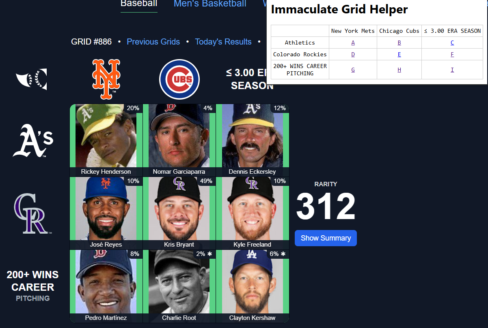

# Immaculate-Grid-Helper

Immaculate-Grid-Helper can help to generate Google search links automatically.

## Installation

1. Clone or download the repository to local.
2. Open Chrome and navigate to `chrome://extensions/`.
3. Eable `Developer mode`.
4. Click `Load unpacked` and select the folder of this extension

## Usage

1. Navigate to [https://www.immaculategrid.com/](https://www.immaculategrid.com/)
2. Click the extension icon.
3. The popup will automatically display a table with searching links. 
4. Click any link to open a Google search in a new tab.

